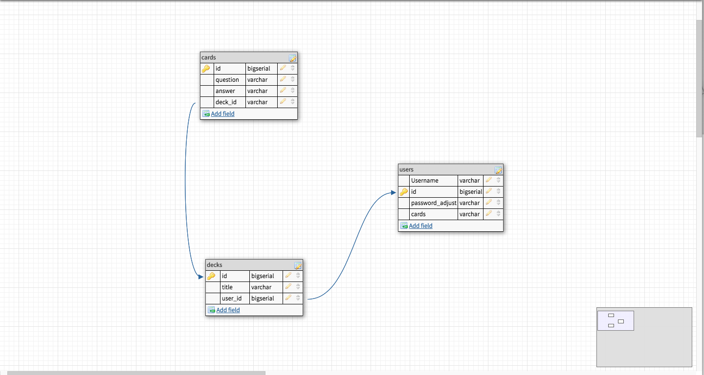

# flash-cards

Haalby's Flash Card App

## Database

The Database for the MVP consist of 3 tables

* a Users table for user information

  * User ID - Primary Key(Bigserial)
  * Username (varchar)
  * Hashed Password (varchar)
  * Deck ID - Foreign Key Referencing decks.id (Bigserial)

* a Decks table for deck information

  * Deck ID - Primary Key(Bigserial)
  * Title (varchar)
  * User ID - Foreign Key Referencing users.id (Bigserial)

* a Cards table for card information

  * Card ID - Primary Key(Bigserial)
  * Question (varchar)
  * Answer (varchar)
  * Deck ID - Foreign Key Referencing decks.id (Bigserial)

